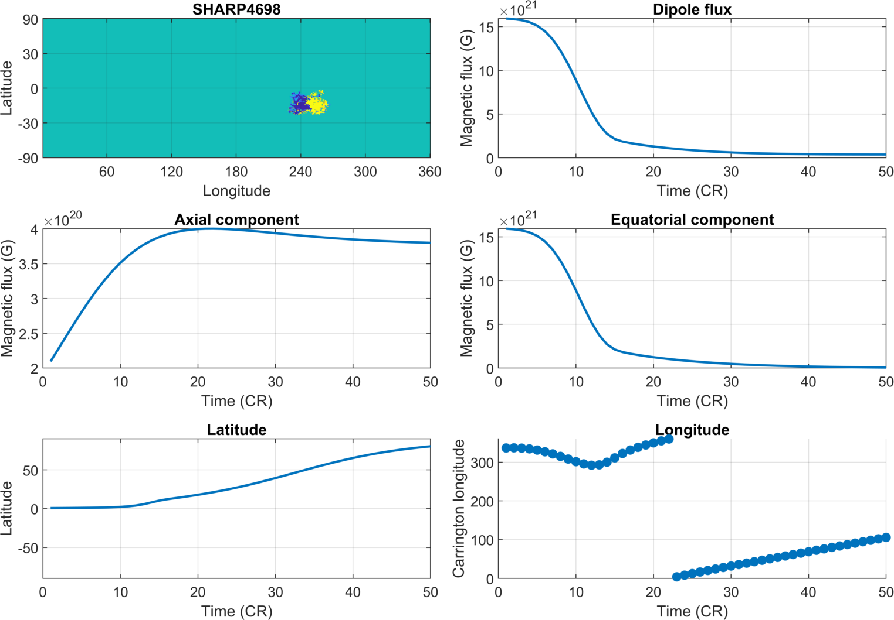

# Dipole flux transport

This repository provides code used for the dipole flux transport (DFT) simulations in the paper

**Tähtinen, Asikainen & Mursula (2026)**  
*Ultra-fast simulations of the solar dipole and open flux*  
Submitted to Astronomy & Astrophysics

`CreateFullPropagator.m`: Run this to create full propagator matrices needed for DFT simulations

`DFTExamplesTimeit.m`: Code used to produce the results shown in Table 1 of the paper.

`DFTSingleMap.m`: Runs DFT independently for a single or multiple maps of active regions.

`DFTSim.m`: Runs DFT for multiple active regions emerging at arbitrary times and calculates their total dipole vector.

`Calc3DVectorSum.m`: Computes the 3‑component solar dipole vector from a stack of synoptic magnetograms using the vector sum method of Tähtinen et al. (2024,2026)

`SumDipoleVectorsRad.m`: Utility that sums dipole vectors.

`sft_sim_lin.m`: Reference SFT implementation used for validation and baseline comparisons in the paper.

**References**

Tähtinen, I., Asikainen, T., & Mursula, K. (2024), Astronomy and Astrophysics, 688, L32, https://doi.org/10.1051/0004-6361/202451267

Tähtinen, I., Asikainen, T., & Mursula, K. (2026), Astronomy and Astrophysics, 706, A235, https://doi.org/10.1051/0004-6361/202557466
